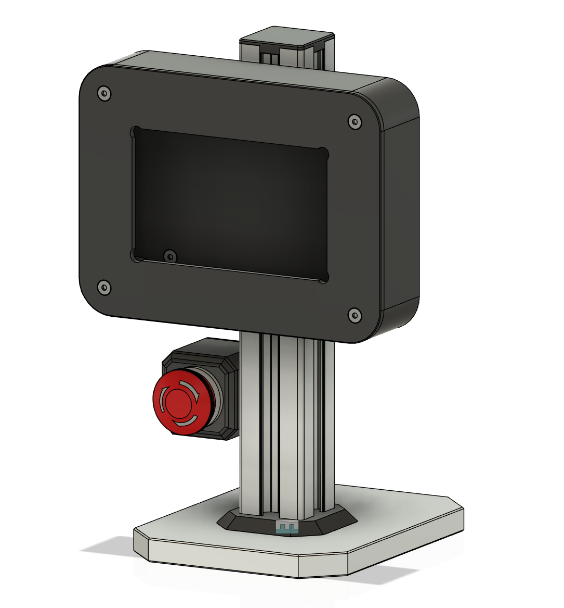
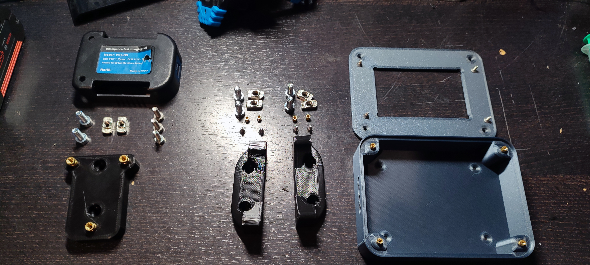
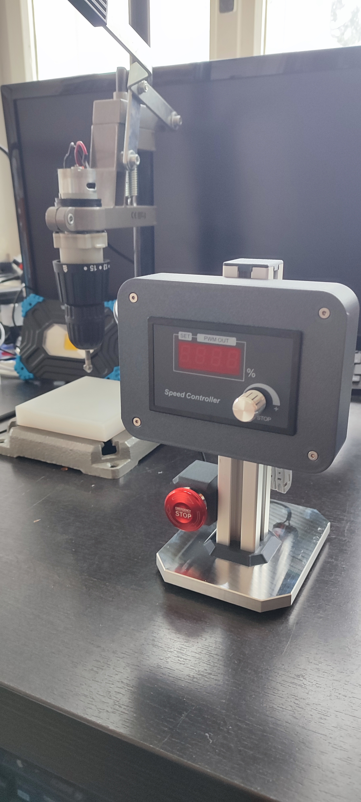
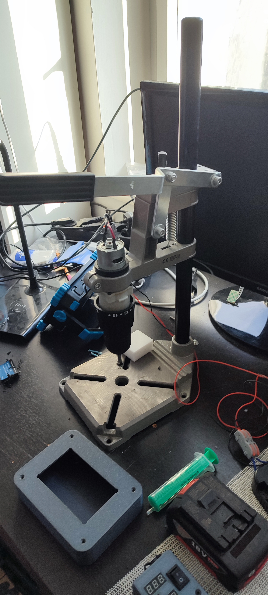
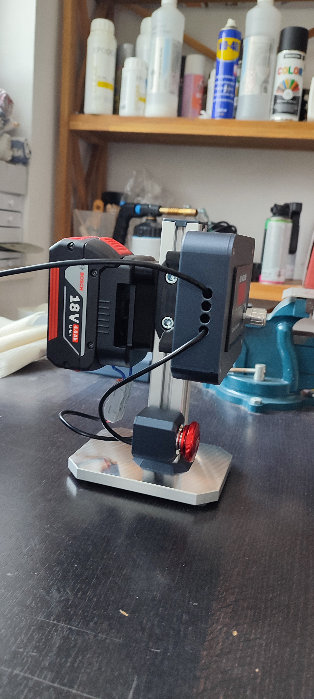
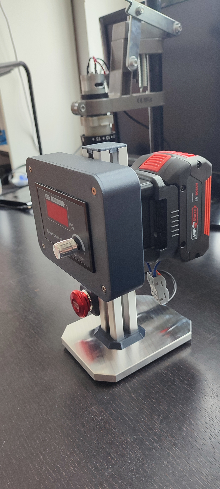
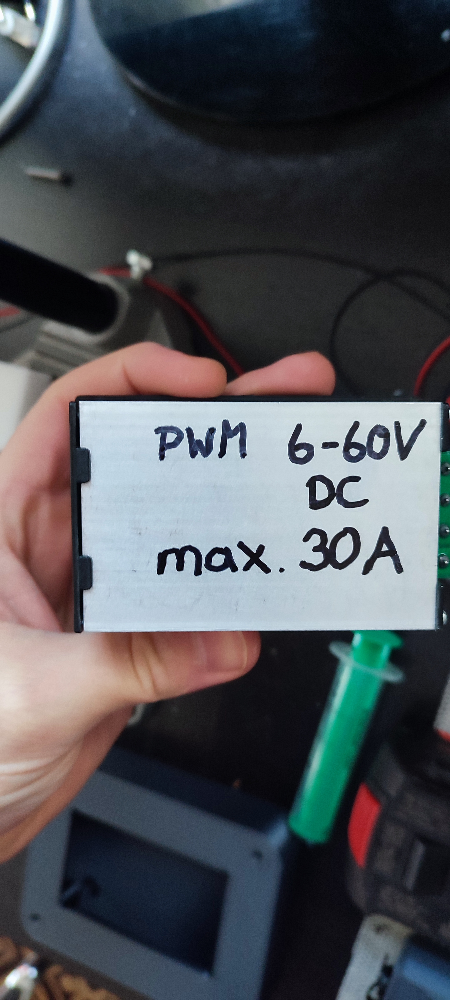

# DC-PWM-Controller
This device is an adjustable (0-100%) PWM-DC motor controller.
It uses a 18V 4000mAh Bosch professional Li-Ion Battery.

## Product demonstration
This is the CAD-view from the outside:

## The following components are used:
- All custom parts are printed with [CF-PLA](https://www.amazon.de/dp/B0CH36F58Y) and [PLA+](https://www.amazon.de/dp/B07FQDKR28).
- To wire all connections, this [cable](https://www.amazon.de/dp/B0BMC9K9P4) was used.
- 1 x [PWM Controller](https://www.amazon.de/Motordrehzahlregler-Binghe-einstellbare-Numerische-DC-Motoren/dp/B0DKJ2BG5K/ref=sr_1_48?__mk_de_DE=%C3%85M%C3%85%C5%BD%C3%95%C3%91&sr=8-48).
- 1 x [200mm Alu profil 30x30](https://www.amazon.de/Alu-Profil-St%C3%BCck-30x30mm-200mm-Konstruktionsprofil/dp/B08H1JNS8N/ref=sr_1_7?sr=8-7).
- 1 x [Bosch professional Battery](https://www.amazon.de/Bosch-Professional-Akkuspannung-Akkukapazit%C3%A4t-Gewicht/dp/B00IKI352E/ref=sr_1_3?__mk_de_DE=%C3%85M%C3%85%C5%BD%C3%95%C3%91&sr=8-3).
- 1 x [Bosch Akku adapter](https://www.amazon.de/QUPERR-Akku-Adapter-USB-Ladeger%C3%A4t-Dual-USB-Handy-Ladeger%C3%A4t-Adapter-Schnellladung%EF%BC%88Nur/dp/B0CLLKGNL8/ref=sr_1_3?__mk_de_DE=%C3%85M%C3%85%C5%BD%C3%95%C3%91&sr=8-3).
- 1 x [Emergency stop button](https://www.amazon.de/dp/B08ZS8HZYV).
- 2 x [Cable grommet M5](https://www.amazon.de/Durchgangst%C3%BCllen-Kabeldurchf%C3%BChrung-Gummidichtungsset-Gummistopfen-Elektroinstallation/dp/B0B5DLWVZ2/ref=sr_1_5?__mk_de_DE=%C3%85M%C3%85%C5%BD%C3%95%C3%91&sr=8-5).
- 7 x [M6 x 16mm Inbus Innensechskant](https://www.amazon.de/SECCARO-Zylinderschraube-Edelstahl-Innensechskant-St%C3%BCck/dp/B00I20HLCK/ref=sr_1_5?__mk_de_DE=%C3%85M%C3%85%C5%BD%C3%95%C3%91&sr=8-5).
- 7 x [M6 Hammerkopfmutter](https://www.amazon.de/Bikasun-Hammerkopfmutter-Kohlenstoffstahl-Aluminiumprofil-Extrusionsschlitz/dp/B0CN2HDJ54/ref=sr_1_5?__mk_de_DE=%C3%85M%C3%85%C5%BD%C3%95%C3%91&sr=8-5).
- 1 x [M8 x 25mm Inbus Innensechskant](https://www.amazon.de/SECCARO-Zylinderschraube-Edelstahl-Innensechskant-St%C3%BCck/dp/B09PDXP13G/ref=sr_1_5?__mk_de_DE=%C3%85M%C3%85%C5%BD%C3%95%C3%91&sr=8-5).
- 3 x [M5 x 20mm Inbus Innensechskant](https://www.amazon.de/Zylinderschrauben-mit-Innensechskant-Vollgewinde-Zylinderkopfschrauben/dp/B01H9M294G/ref=sr_1_7?__mk_de_DE=%C3%85M%C3%85%C5%BD%C3%95%C3%91&sr=8-7).
- 3 x [Heat insert M5](https://www.amazon.de/Gewindeeinsatz-Einpressmutter-Gewindebuchsen-Kunststoff-Box-Kunststoffteiledurch/dp/B09B7F2XM3/ref=sr_1_5?__mk_de_DE=%C3%85M%C3%85%C5%BD%C3%95%C3%91&sr=8-5).
- 8 x [M3 x 10mm flat head screw](https://www.amazon.de/gp/product/B09Y2SDQKS/ref=ppx_yo_dt_b_search_asin_title?ie=UTF8).
- 8 x [Heat insert M3](https://www.amazon.de/Gewindeeinsatz-Einpressmutter-Gewindebuchsen-Kunststoff-Box-Kunststoffteiledurch/dp/B09B7F2XM3/ref=sr_1_5?__mk_de_DE=%C3%85M%C3%85%C5%BD%C3%95%C3%91&sr=8-5).

These are some screws and parts of the product:

## Scematic
Battery to switch (live wire in series) to PWM-Controller to Motor.

This is the product from the front:

This is the drill press with motor:

This is the product from the left:

This is the product from the right:

This is the PWM-Controller from the back (essentials):

